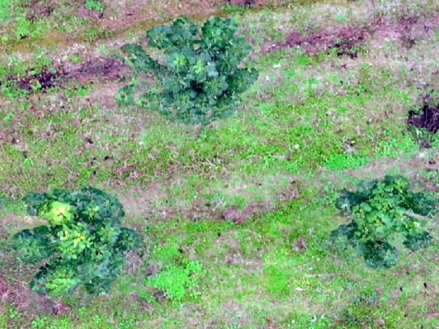
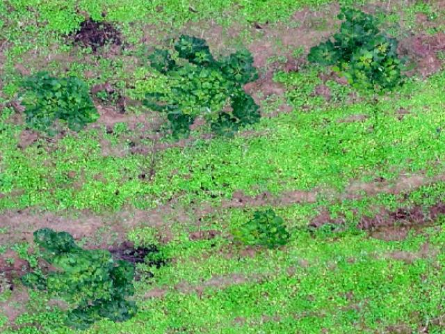

# VSGNet

This repository is the official implementation of VSGNet.

# Paper
under submitting

# Introduction
Framework overview

# Forests dataset
Sample images from the Forests dataset used in our paper
